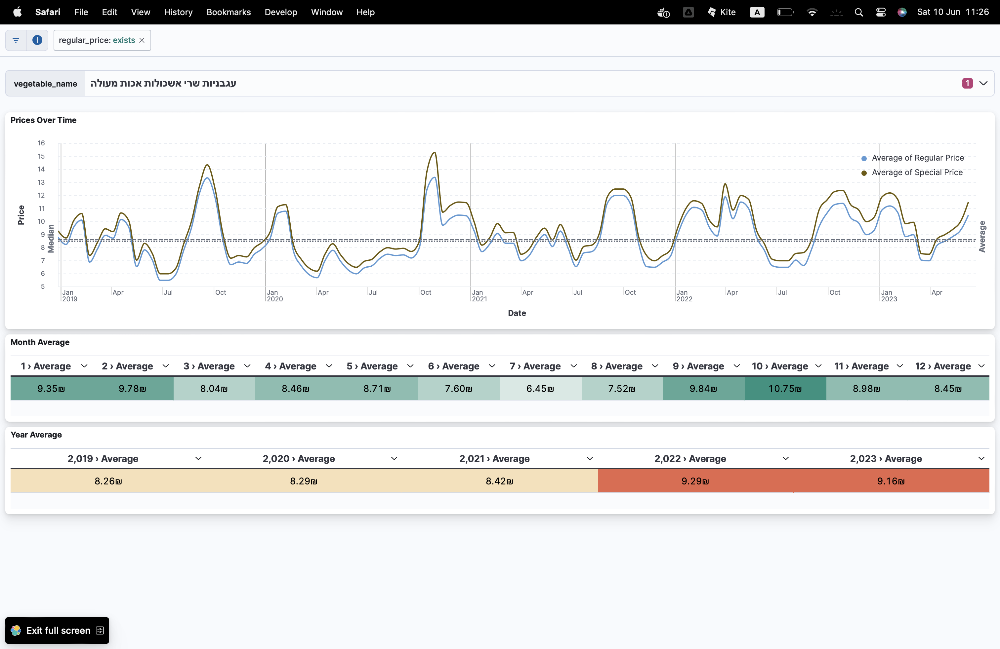

# veg_prices

The idea of this project is to give agriculturals the ability to decide how to manage their harvesting.
The data is scraped on demand from Plants Council Website, indexed to elasticsearch and visualize using kibana. 

## The components:
- Data collector - REST server which scrap data and load it to an elasticsearch on demand 
- Elasticsearch - For the indexing. 
- Kibana - In order to visualize the data. 

## How to run?
1. execute raise_app.sh script
2. Load the [dashboard](assets/market_prices_dashboard.ndjson) to kibana
3. For configured rest requests, use [this](market_prices_client.paw) configuration to RapidApi client (Mac)

## Example

