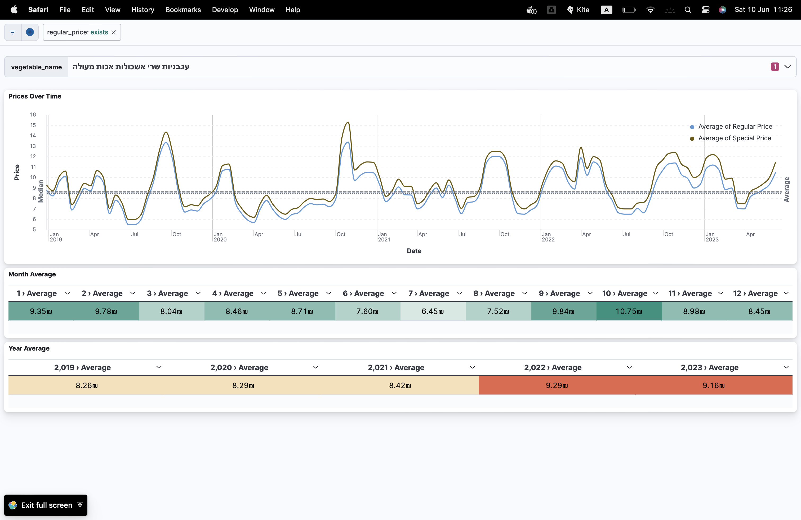

# veg_prices

The idea of this project is to give farmers the ability to decide how to manage their harvesting.
Vegetable prices are scraped daily from the Plants Council website, enriched with weather and the holidays
calendar, indexed to Elasticsearch and served to a Hebrew web app that turns them into decisions:
is now a good time to sell, what is the price likely to do, and when to plant so the harvest lands in the
expensive part of the season.

## The components
- **Web app** (`services/web`) - React + Vite, Hebrew / RTL, mobile first. Served by nginx which proxies `/api` to the REST service. Port `3000`.
- **REST Scraper** (`services/rest_scraper`) - FastAPI. Scrapes on demand, loads weather and holidays, and exposes the `/analytics` endpoints the web app renders. Port `80`, docs at `http://localhost/docs`.
- **Periodic Scraper** (`services/periodic_scraper`) - loads the full history on start, then refreshes prices, weather and holidays every day at noon.
- **Elasticsearch** - the store (`market_prices_index`, `weather_index`, `holidays_index`). Port `9200`.
- **Kibana** - ad-hoc exploration. Port `5601`, dashboard in [assets/market_prices_dashboard.ndjson](assets/market_prices_dashboard.ndjson).

## Data sources
| Source | What | Fetcher |
|---|---|---|
| [Plants Council](https://plants.moonsite.co.il) | Daily regular / special price per product | `common/plants_council_scraper.py` |
| [Open-Meteo](https://open-meteo.com) | Daily max/min temperature and rain per growing region (Arava, Beit She'an, Besor), history + 7 day forecast | `common/weather_client.py` |
| [Hebcal](https://www.hebcal.com) | Israeli holidays calendar 2005 → +2 years | `common/holidays_client.py` |
| [CBS](https://apis.cbs.gov.il) | Statistical series (optional) | `common/cbs_api_client.py` |

The Plants Council search matches by **substring**: asking for `עגבני` returns every tomato product. The scraper
takes the product name from each row, so `GET /market_prices/products?query=עגבני` is the way to discover exact
names before adding them to [vegetables_list.json](services/periodic_scraper/src/vegetables_list.json).

## How to run
1. Start everything: `./raise_app.sh` (or `docker compose up --build -d`).
2. Wait a few minutes for the periodic scraper to load the history (prices, weather, holidays).
3. Open the app at **http://localhost:3000**.
4. Optional: load the [Kibana dashboard](assets/market_prices_dashboard.ndjson) at http://localhost:5601.

Manual loads through the REST API:
```bash
curl -X POST localhost/market_prices/load_prices -H 'Content-Type: application/json' -d '{"vegetable_name": "עגבניות שרי אשכולות אכות מעולה"}'
curl -X POST localhost/weather/load  -H 'Content-Type: application/json' -d '{}'
curl -X POST localhost/holidays/load -H 'Content-Type: application/json' -d '{}'
```

## What the analytics do
Everything is computed from the indexed data (`rest_scraper/src/analytics.py`), one call: `GET /analytics/dashboard?vegetable=...`.
- **Seasonal norm** - median across baseline years (2015+) of a ±7 day rolling mean, per day of year, scaled to the last year's price level.
- **Forecast** - blends today's deviation from the norm (weighted by how long deviations persist, measured by autocorrelation) with the norm at the target date, plus a small weather adjustment. The ±band is the 80th percentile absolute error from a backtest on the last 3 years with out-of-year baselines.
- **Holidays** - price around each holiday's first day relative to that year's mean, averaged over years, with consistency.
- **Planting** - for each planting week, the expected norm over the harvest window given days-to-harvest.
- **Weather signal** - temperature anomaly of the last 60 days in the Arava vs. the price anomaly two months later.

## Example

